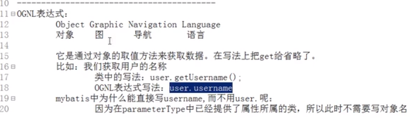
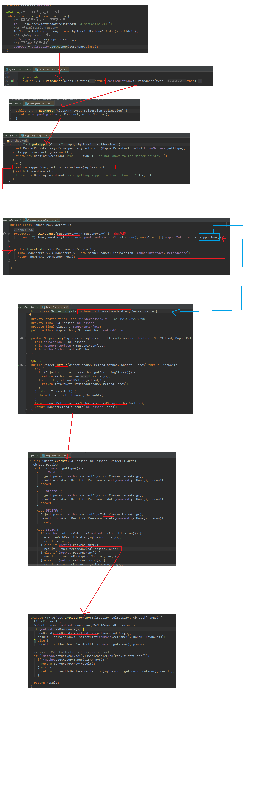

Mybatis-持久层
===============

## 基础技术
- Spring
- Mysql
- java8

## 包含部分
```
- JDBC技术: 数据库连接的规范 Connection、PreparedStatement、ResultSet（jdbc-demo）
- Spring的JdbcTemplate: Spring中对jdbc的简单封装的工具类
- Mybatis环境搭建示例：默认的动态代理 基于xml(mybatis-demo)
- Mybatis环境搭建示例：默认的动态代理 基于注解(mybatis-annotation-demo)
- Mybatis实现dao接口示例：一般不采用，但Mybatis支持实现dao接口的方式(mybatis-dao-impl-demo)
- Mybatis自定义示例（重要）:基于xml和注解的两种方式(mybatis-design-demo)
- Mybatis示例:默认的动态代理 基于xml 使用properties标签配置数据库信息(mybatis-demo-properties)
- Mybatis高级部分：连接池、事务、动态SQL、多表操作（重要）、延迟加载、缓存、注解开发
```

## JDBC缺陷
- jdbc-demo模快给出代码示例，mysql安装在腾讯云服务器上，需要如下准备步骤
```
一、新建mysql远程访问账号，授予权限，允许远程IP访问
二、/etc/mysql/mysql.conf.d/mysqld.cnf配置文件里将bind-address = 127.0.0.1 改成 bind-address = 0.0.0.0
三、配置腾讯云安全组，开放3306端口，不安全，建议Nginx反向代理
```


## Mybatis的概述
- [Mybatis官网](https://mybatis.org/mybatis-3/zh/getting-started.html)


## Mybatis的环境搭建步骤
```
- 创建maven工程并导入依赖
- 创建实例类（domain）和dao（或者mapper）的接口
- 创建Mybatis的主配置文件 SqlMapConfig.xml
- 创建映射配置文件 IUserDao.xml
注：IUserDao和IUserMapper是一样的
注：Mybatis的映射配置文件位置必须和dao接口的包结构相同
```
## Mybatis基于注解的方式
```
相比xml配置不需要映射配置文件，只需要在dao接口方法上使用@Select注解指定sql语句
同时需要在主配置文件 SqlMapConfig.xml中的mapper配置时，使用class属性指定dao接口的全限定类名
```
## Mybatis设计模式的分析
- 读取配置文件
```
InputStream in = Resources.getResourceAsStream("SqlMapConfig.xml");
一般情况下，不使用绝对路径和相对路径。
两种方案：
  一、使用类加载器，它只能读取类路径的配置文件
  二、使用ServletContext对象的getRealPath()
  ```
- 创建SqlSessionFactory工厂
```
SqlSessionFactoryBuilder builder = new SqlSessionFactoryBuilder();
SqlSessionFactory factory = builder.build(in);
创建工厂Mybatis使用了构建者模式-把对象的创建细节隐藏，使用者直接调用方法即可拿到对象
```
- 使用工厂生产SqlSession对象
```
SqlSession session = factory.openSession();
生产SqlSession使用了工厂模式-解耦，降低类之间的依赖关系
```
- 使用SqlSession创建Dao接口的代理对象
```
IUserDao userDao = session.getMapper(IUserDao.class);
创建Dao接口实现类使用了代理模式（动态代理）-不修改源码的基础上对已有方法增强
```

## Mybatis的自定义（重要）
- Mybatis代理dao接口的过程：
```
一、创建代理对象
二、在代理对象中调用selectList
```
- Mybatis示例中查询所有的分析：

```
注：映射信息定义成一个对象，由于每个dao接口方法都有一个映射信息对象，因此用map保存这些信息，
key是方法全限定类名 + '.' + 方法名
value是Mapper对象，包括sql语句和封装结果的实体类全限定名

注：图中执行jdbc的过程可以参考jdbc-demo
注：解析xml技术 本文不深入
```
- Mybatis中创建代理对象的分析：

```
采用jdk提供的动态代理技术来实现
一般两种动态代理技术：
  jdk动态代理
  CGLIB动态代理
```
- 自定义Mybatis实现的类和接口：
```
class Resources
class SqlSessionFactoryBuilder
interface SqlSessionFactory
interface SqlSession
```
## Mybatis的CURD
- 位于mybatis-demo示例
- Mybatis中文乱码
```
<!-- 配置连接数据库的4个基本信息 -->
<property name="driver" value="com.mysql.jdbc.Driver"/>
<property name="url" value="jdbc:mysql://49.233.42.22:3306/mybatis_demo?useUnicode=true&amp;characterEncoding=utf-8"/>
<property name="username" value="ts-mysql"/>
<property name="password" value="123456abcD!"/>
设置useUnicode字符集
设置characterEncoding编码方式为utf-8
&amp; 用于将&转义 xml里需要 配置文件内则不需要
```
- Mybatis的#{}和${}
```
  ${}是 Properties 文件中的变量占位符，它可以用于标签属性值和 sql 内部，属于静态文本替换，
比如${driver}会被静态替换为com.mysql.jdbc.Driver
  #{}是 sql 的参数占位符，MyBatis 会将 sql 中的#{}替换为?号，
在 sql 执行前会使用 PreparedStatement 的参数设置方法，按序给 sql 的?号占位符设置参数值，
比如 ps.setInt(0, parameterValue)，#{item.name} 的取值方式为使用反射从参数对象中获取 item 对象的 name 属性值，相当于 param.getItem().getName()
```

- Mybatis获取saveUser的id
```
   <!--保存用户-->
   <insert id="saveUser" parameterType="com.mybatis.domain.User">
        <selectKey keyProperty="id" keyColumn="id" resultType="int" order="AFTER">
            select last_insert_id();
        </selectKey>
        insert into user(username,address,sex,birthday)values(#{username},#{address},#{sex},#{birthday});
   </insert>
说明：
keyProperty 实体对象属性
keyColumn 表的列属性
resultType 返回类型
order 相对sql语句的执行顺序
注：调用接口方法后，id会自动注入到实体类的id中
```
## Mybatis的参数深入
- Mybatis的 parameterType 类型
```
简单类型

pojo对象
    Mybatis使用ognl表达式解析对象字段的值
pojo包装对象
```

- Mybatis的 parameterType 类型中pojo包装对象示例
```
public class QueryVo {
    private User user;

    public User getUser() {
        return user;
    }

    public void setUser(User user) {
        this.user = user;
    }
}
```
```
List<User> findUserByVo(QueryVo vo);
```
```
    <!--根据QueryVo的条件查询用户-->
    <select id="findUserByVo" parameterType="com.mybatis.domain.QueryVo" resultType="com.mybatis.domain.User">
        select * from user where username like #{user.username}
    </select>
```
## Mybatis的返回值深入
- Mybatis的 resultType 类型
```
简单类型
pojo对象
pojo列表
```
- Mybatis的 实体类属性和数据库列名不一致时，解决方法
```
方法一：别名
<select id="findAll" resultType="com.mybatis.domain.User">
    select id as userId,username as userName,address as userAddress from user;
</select>
只要保证别名和实体类属性一致即可
```
```
方法二：配置映射
    <!--配置对应关系-->
    <resultMap id="userMap" type="com.mybatis.domain.User">
        <!--主键字段的对应-->
        <id property="userId" column="id"></id>
        <!--非主键字段的对应-->
        <result property="username" column="userName"></result>
        <result property="address" column="userAddress"></result>
    </resultMap>
    <select id="findAll" resultMap="userMap">
        select * from user;
    </select>
```
## Mybatis实现dao接口(一般不采用，但Mybatis支持实现dao接口的方式，仅供了解)
- 位于mybatis-dao-impl-demo示例
- Mybatis内部是通过动态代理生成dao接口的代理对象来实现功能的
## Mybatis实现dao接口和代理dao接口区别
- mybatis实现dao接口的执行过程

- mybatis代理dao接口的执行过程

## Mybatis的properties标签
- 位于mybatis-demo-properties
- properties标签内部配置连接数据库的信息 一般不使用
```
<?xml version="1.0" encoding="UTF-8"?>
<!DOCTYPE configuration
        PUBLIC "-//mybatis.org//DTD Config 3.0//EN"
        "http://mybatis.org/dtd/mybatis-3-config.dtd">
<!--properties标签内部配置连接数据库的信息 一般不使用-->
<configuration>
    <properties>
        <property name="driver" value="com.mysql.jdbc.Driver"></property>
        <property name="url" value="jdbc:mysql://localhost:3306/mysql_mybatis"></property>
        <property name="username" value="root"></property>
        <property name="password" value="1234"></property>
    </properties>

    <!--配置环境-->
    <environments default="mysql">
        <!-- 配置mysql的环境-->
        <environment id="mysql">
            <!-- 配置事务 -->
            <transactionManager type="JDBC"></transactionManager>

            <!--配置连接池-->
            <dataSource type="POOLED">
                <property name="driver" value="${driver}"></property>
                <property name="url" value="${url}"></property>
                <property name="username" value="${username}"></property>
                <property name="password" value="${password}"></property>
            </dataSource>
        </environment>
    </environments>
    <!-- 配置映射文件的位置 -->
    <mappers>
        <mapper resource="com/mybatis/dao/IUserDao.xml"></mapper>
    </mappers>
</configuration>
```
- properties标签内通过属性引用外部配置文件信息 常用 示例见代码
注意：外部配置文件中不需要&转义
## Mybatis的typeAliases标签和package标签
```
    <!--使用typeAliases配置别名，它只能配置domain中类的别名 -->
    <typeAliases>
        <!--typeAlias用于配置别名。type属性指定的是实体类全限定类名。alias属性指定别名，当指定了别名就再区分大小写 
        <typeAlias type="com.mybatis.domain.User" alias="user"></typeAlias>-->

        <!-- 用于指定要配置别名的包，当指定之后，该包下的实体类都会注册别名，并且类名就是别名，不再区分大小写-->
        <package name="com.mybatis.domain"></package>
    </typeAliases>
```
```
    <!-- 配置映射文件的位置 -->
    <mappers>
        <!--<mapper resource="com/mybatis/dao/IUserDao.xml"></mapper>-->
        <!-- package标签是用于指定dao接口所在的包,当指定了之后就不需要在写mapper以及resource或者class了 -->
        <package name="com.mybatis.dao"></package>
    </mappers>
```
Mybatis-高级
===============
## 连接池
```
连接池是存储数据库连接的集合对象，保证线程安全，具备队列特性
```
- Mybatis配置连接池

- Mybatis连接池-POOLED方式
```
PooledDataSource类
private PooledConnection popConnection(String username, String password) throws SQLException
```


- Mybatis连接池-UNPOOLED方式
```
UnpooledDataSource类

private Connection doGetConnection(Properties properties) throws SQLException {
    this.initializeDriver();
    Connection connection = DriverManager.getConnection(this.url, properties);
    this.configureConnection(connection);
    return connection;
}

private synchronized void initializeDriver() throws SQLException {
    if (!registeredDrivers.containsKey(this.driver)) {
        try {
            Class driverType;
            if (this.driverClassLoader != null) {
                driverType = Class.forName(this.driver, true, this.driverClassLoader);
            } else {
                driverType = Resources.classForName(this.driver);
            }

            Driver driverInstance = (Driver)driverType.newInstance();
            DriverManager.registerDriver(new UnpooledDataSource.DriverProxy(driverInstance));
            registeredDrivers.put(this.driver, driverInstance);
        } catch (Exception var3) {
            throw new SQLException("Error setting driver on UnpooledDataSource. Cause: " + var3);
        }
    }

}
```
## 事务
- 概念
```

```
- 特性
```

```
- 多事务下的问题
```

```
- 隔离级别
```

```
- Mybatis事务
```
通过SqlSession类的commit方法和roolback方法实现事务提交和回滚
factory.openSession() 默认autocommit=false
factory.openSession(true) autocommit=true(一般不这样)
```
## 动态SQL
- mybatis-dynamicsql-demo示例
- if标签
```
    <!--根据条件查询-->
    <select id="findUserByCondition" parameterType="user" resultMap="userMap">
        select * from user where 1=1
        <if test="id !=null">
            and id = #{id}
        </if>
        <if test="username !=null">
           and username = #{username}
        </if>
        <if test="birthday !=null">
            and birthday = #{birthday}
        </if>
        <if test="sex !=null">
            and sex = #{sex}
        </if>
        <if test="address !=null">
            and address = #{address}
        </if>
    </select>
```
- where标签
```
    <!--根据条件查询-->
    <select id="findUserByCondition" parameterType="user" resultMap="userMap">
        select * from user
        <where>
            <if test="id !=null">
                and id = #{id}
            </if>
            <if test="username !=null">
                and username = #{username}
            </if>
            <if test="birthday !=null">
                and birthday = #{birthday}
            </if>
            <if test="sex !=null">
                and sex = #{sex}
            </if>
            <if test="address !=null">
                and address = #{address}
            </if>
        </where>
    </select>
```
- foreach标签
```
    <!--根据queryVo中的id集合查询用户-->
    <select id="findUserInIds" resultMap="userMap" parameterType="queryvo">
        select * from user
        <where>
            <if test="ids != null and ids.size()>0">
                <foreach collection="ids" open="and id in (" close=")" item="uid" separator=",">
                    #{uid}
                </foreach>
            </if>
        </where>
    </select>

open 开始部分
close 结束部分
item 每一项的名称
separator 每一项之间的分隔符
```
- sql标签和include标签
```
    <sql id="defaultUser">
        select * from user
    </sql>
    <!--配置查询所有-->
    <!--id是dao接口的方法名-->
    <select id="findAll" resultMap="userMap">
        <include refid="defaultUser"></include>
    </select>
```
## 多表查询
- 表关系


注：如果拿出每一个订单，他都只能属于一个用户
   所以mybatis就把 多对一 看成 一对一
- 多表查询示例
```
用户和账户
    一个用户可以有多个账户
    一个账户只能属于一个用户
步骤：
    1、建立两张表：用户表、账户表
    2、
```
## 延迟加载
```
问题：在一对多中，当我们有一个用户，它有100个账户。
    在查询用户的时候，要不要把关联的账户查出来？
    在查询账户的时候，要不要把关联的用户查出来？
		
    在查询用户时，用户下的账户信息应该是，什么时候使用，什么时候查询的--延迟加载
    在查询账户时，账户的所属用户信息应该是随着账户查询时一起查询出来--立即加载
```
```
什么是延迟加载
    在真正使用数据时才发起查询，不用的时候不查询。按需加载（懒加载）
什么是立即加载
    不管用不用，只要一调用方法，马上发起查询。

```
```
在对应的四种表关系中：一对多，多对一，一对一，多对多
    一对多，多对多：通常情况下我们都是采用延迟加载。
    多对一，一对一：通常情况下我们都是采用立即加载。
```
- 延迟加载示例
## 缓存

- Mybatis一级缓存
```
一级缓存：默认开启
    它指的是Mybatis中SqlSession对象的缓存。
    当我们执行查询之后，查询的结果会同时存入到SqlSession为我们提供一块区域中。
    该区域的结构是一个Map。当我们再次查询同样的数据，mybatis会先去sqlsession中
    查询是否有，有的话直接拿出来用。
    当SqlSession对象消失时，mybatis的一级缓存也就消失了。
```
- Mybatis一级缓存示例
- Mybatis二级缓存
```
二级缓存：默认不开启
    它指的是Mybatis中SqlSessionFactory对象的缓存。
    由同一个SqlSessionFactory对象创建的SqlSession共享其缓存。
注：二级缓存存放的是数据，使用的时候才封装成对象返回
```

- Mybatis二级缓存的使用步骤
```
第一步：让Mybatis框架支持二级缓存（在SqlMapConfig.xml中配置）
```

```
第二步：让当前的映射文件支持二级缓存（在IUserDao.xml中配置）
```

```
第三步：让当前的操作支持二级缓存（在select标签中配置）
```

## 注解开发
